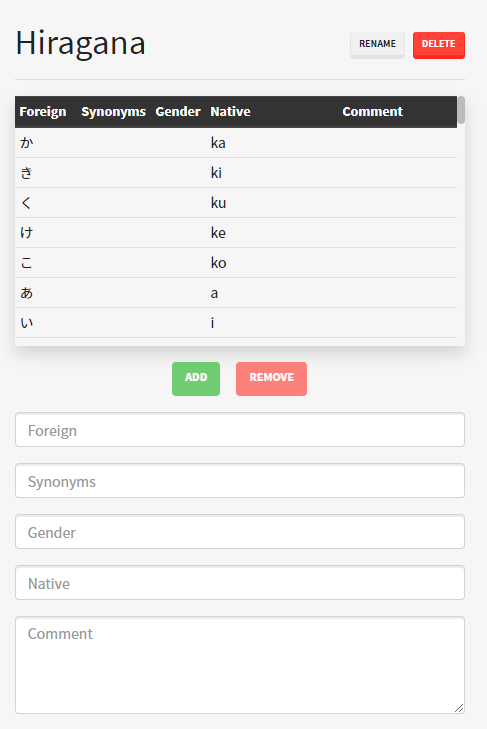

# Adding vocabulary
Getting vocabulary into kanjiclub is easy. There are three ways to do this:

## 1. The Editor
You can record words manually from sources such as a textbook using the builtin editor:



- To add a new word, fill out at least the `Foreign` and `Native` fields and press `Add` or the Enter key on your keyboard. The word will now appear on the bottom of the list, and the lesson is saved automatically.
- To modify or remove an existing word, select a word in the list. The editor is now in modifying mode. The selected word will be higlighted in the list, and you can Update its contents, or remove it. To exit modifying mode, click the `Cancel Edit` button.

## 2. Custom text data
The custom text data importer is a powerful tool to get any kind of already digital data into Kanjiclub. It's a plaintext importer with a template at the top.

Suppose you have the following dataset from a different source in plaintext:
```
ka

か

ku

く
```

For a human, this is clearly the native and the foreign field always followed by a newline. For kanjiclub to understand such data, we have to define a template at the top of the `.txt` file. This is very simple:

A template line always begins with a backtick (`` ` ``). The template for the file above would be:
```
`native
`
`foreign
`
```
Which tells Kanjiclub to interpret the data as native, followed by newline, follwed by foreign and another newline.
This works with any of the available word data fields `foreign`, `synonym`, `gender`, `native`, `comment`.

## 3. Importing from existing software
Kanjiclub currently supports importing vocabulary from [ebVocab](https://github.com/ebVocab) and [Vocup](https://github.com/daniel-lerch/vocup). Just use the `Edit > Import` function to upload the files from those projects to Kanjiclub, and they'll show up in your lesson overview.

> If you'd like to add support for more software, feel free to open a pull request on GitHub :^)
